# Secret Stones

*Written by Elizabeth Charman*

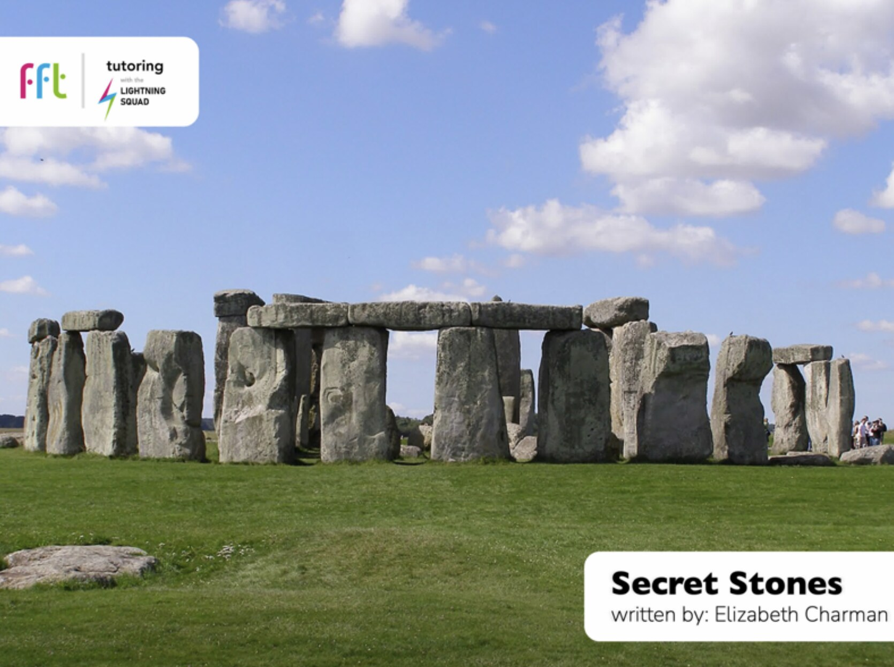

Source: FFT Tutoring with the Lightning Squad (tutoring.fft.org.uk), screenshots captured 5 Oct 2026

Vocabulary (boxed in the app): structures, archaeologists, excavated, dedication, quarried, burial, extraordinary, port, generation

**Total: 806 words across 10 pages**

## 1/10 — Clues to the Past

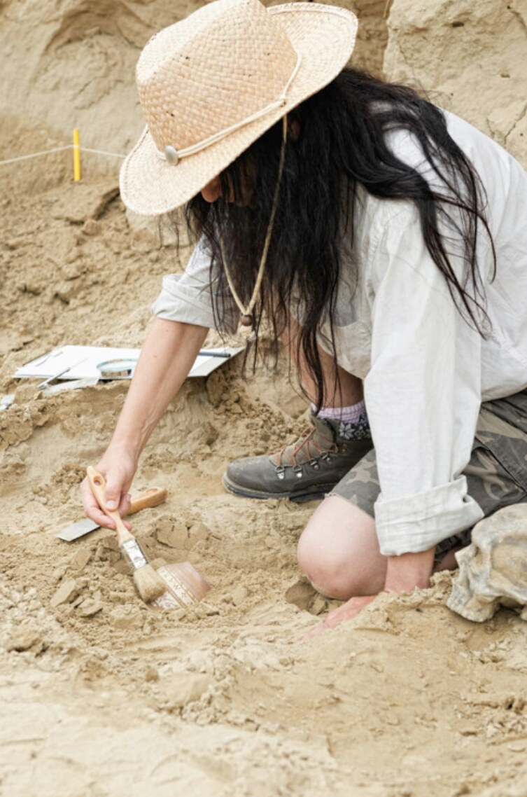

Across the world, the past is still with us in the form of ancient stone **structures**. For many **structures**, exactly what their purpose was and how they were made is a mystery to us. By considering what is left in stone, we can wonder at how the people who made them lived and what they cared about. Some people make it their life’s work to explore how ancient peoples lived. These are **archaeologists**. They work by studying the remains of the past and trying to make connections to us today.

*(90 words)*

## 2/10 — A Place of Worship

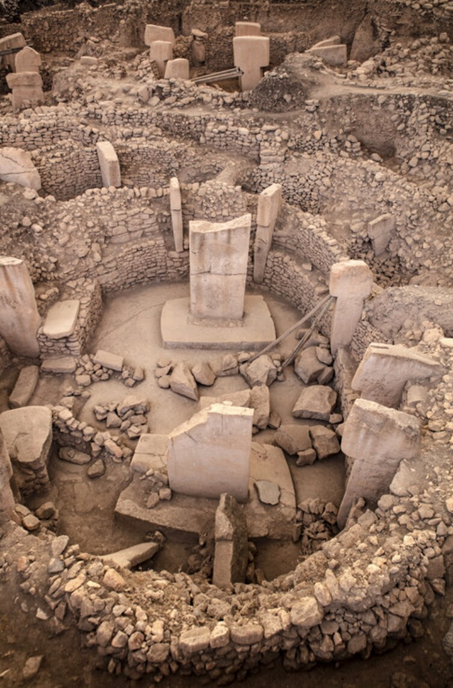

In modern-day Turkey, there is a place called Göbekli Tepe. In English, that means Potbelly Hill. In the 1960s, **archaeologists** carefully **excavated** the site to reveal large circular stones supported by massive pillars. Many of the pillars are decorated with detailed carvings of animals and people on some of the stones. It appears to have been a place of worship, about 11,000 years old. This makes it the oldest set of buildings of that kind that we know

*(78 words)*

> Note: Text appears to end without a full stop in the original screenshot; the page may have been cut off. Check against source.

## 3/10 — Standing Stones

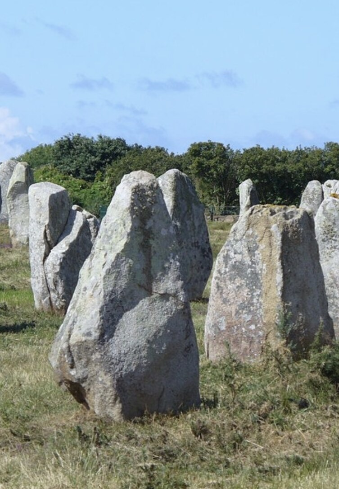

A more mysterious ancient stone structure can be found in north-west France at a village called Carnac. Here, there are row upon row of standing stones, carefully placed by people about 6000 years ago. They are upright and were placed in order of height. We don’t know why this was done, but it must have been important because it would have taken huge effort and **dedication** by many people over a long period of time. Great Britain has standing stones as well. Some lie on farmland where not many people give them much notice or thought. However, some are very famous and attract over a million visitors a year.

*(109 words)*

## 4/10 — Stonehenge

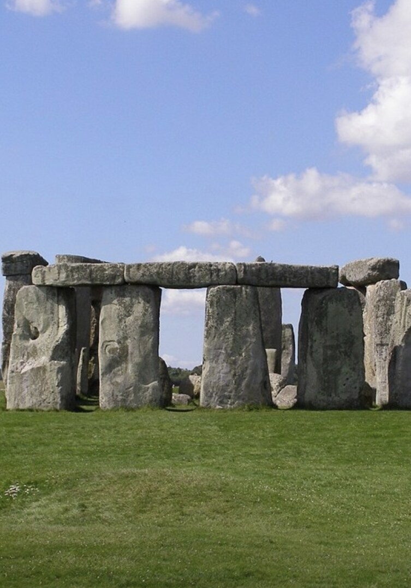

Stonehenge is one of England’s most famous mysteries. Located in Wiltshire, Stonehenge is made up of two circles of standing stones, each around 5,000 years old. **Archaeologists** think workers took about 1,500 years to build it, sometimes stopping for hundred-year periods. Some of the biggest stones weigh 40 tonnes and were **quarried** locally. Many others, though, came from Wales. How did people transport the heavy stones over 200 miles to Stonehenge without using wheels (which hadn’t been invented yet)? It remains a mystery to this day.

*(86 words)*

## 5/10 — Stonehenge

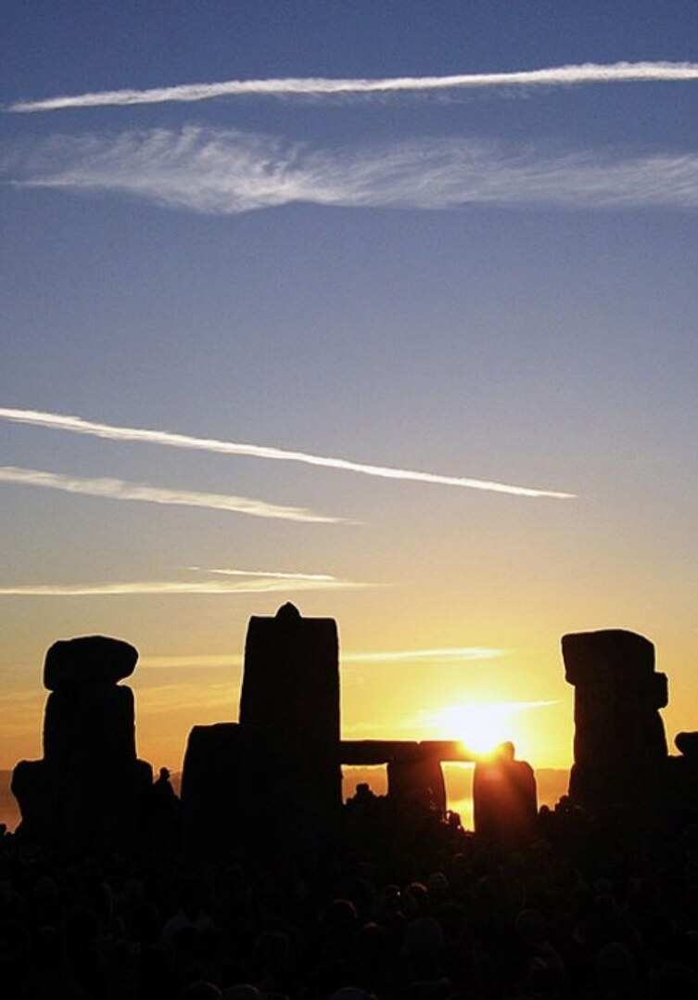

Stonehenge itself seems to have been used as a **burial** ground and a place of worship because human remains have been found at the site. Others think it might have been a huge calendar because its entrance faces the rising sun on the first day of summer. Today, it remains a place to connect with the power of nature. At sunrise on Midsummer’s Day, huge crowds gather to witness the rising sun light up the entrance way to the stones.

*(80 words)*

> Note: 'burial' is bold in the app but not boxed like the other vocabulary words.

## 6/10 — Easter Island

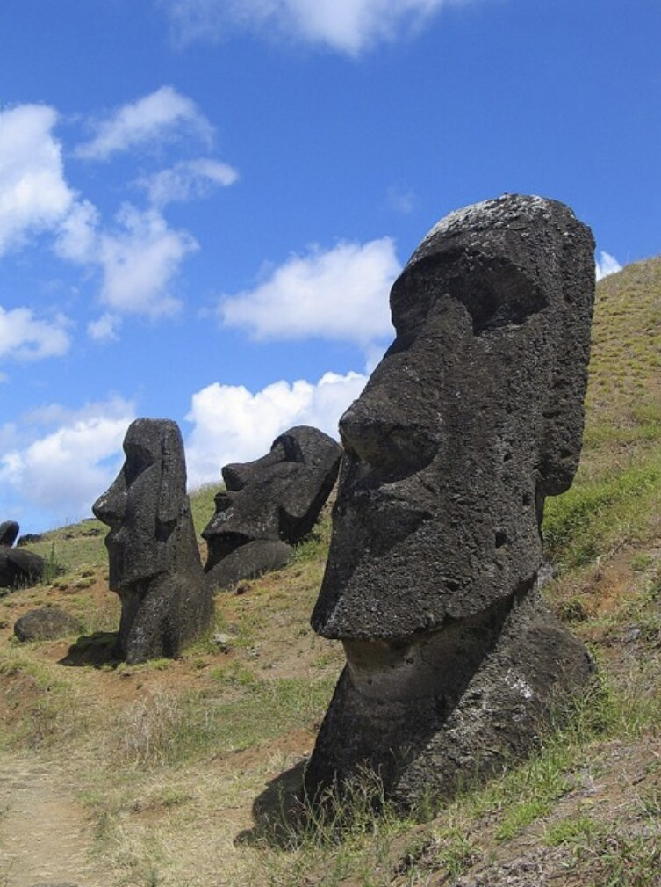

Easter Island lies in the Pacific Ocean, off the west coast of Chile. It is known the world over for its **extraordinary** stone statues that look like massive heads, some of which are over 4m tall! There are over 900 statues on the island, and most are over 500 years old. **Archaeologists** believe that they were carved to represent the spirits of the ancestors of the island.

*(67 words)*

## 7/10 — Easter Island

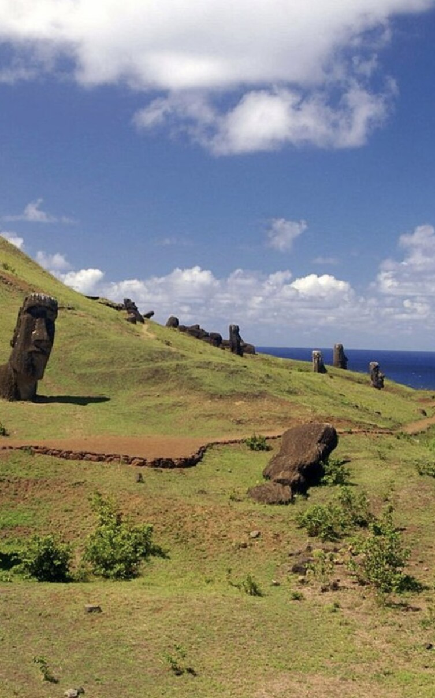

Just like Stonehenge, it remains a mystery how the heavy stones were moved into place. One possibility is that they were ‘walked’ into place by shifting one corner at a time, so they were moved without the whole weight having to be lifted. Another idea is that the stones were put on a row of logs so they could be rolled along rather than lifted.

*(65 words)*

## 8/10 — Cleopatra’s Palace

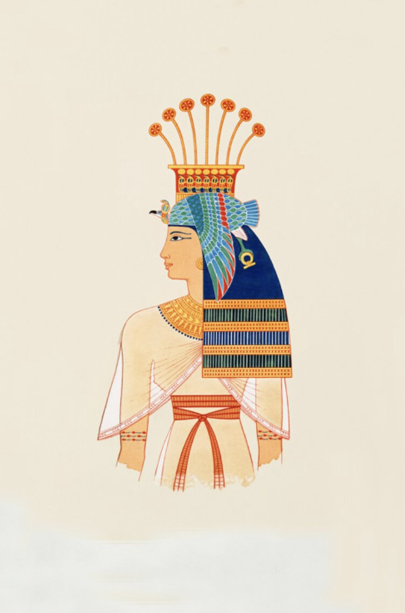

Cleopatra was a queen of Egypt who lived over 2000 years ago. One of her palaces was on an island at the **port** city of Alexandria. It was made with great skill and filled with beautiful treasures to show her power and glory. Hundreds of years after Cleopatra’s death, her palace was destroyed during an earthquake and sank beneath the waves. Or so people thought…

*(65 words)*

## 9/10 — Cleopatra’s Palace

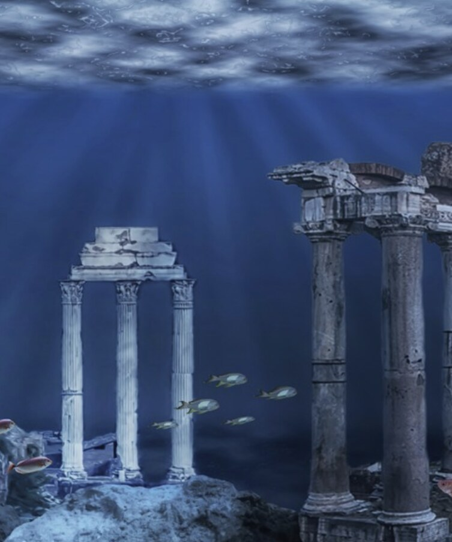

In 1996, divers discovered the remains of a palace beneath the water in Alexandria Harbour. They found what was left of a marble palace, some statues, a temple, and a grand gateway made of sixty crowned stone columns. Some **archaeologists** believed that they had at last found Cleopatra’s long-lost palace. They argued that an earthquake did not destroy it, but rather it sunk along with the entire island, under the sea. Today, divers can visit the sunken palace and see what remains of Cleopatra’s treasures.

*(85 words)*

## 10/10 — Monuments in the Future

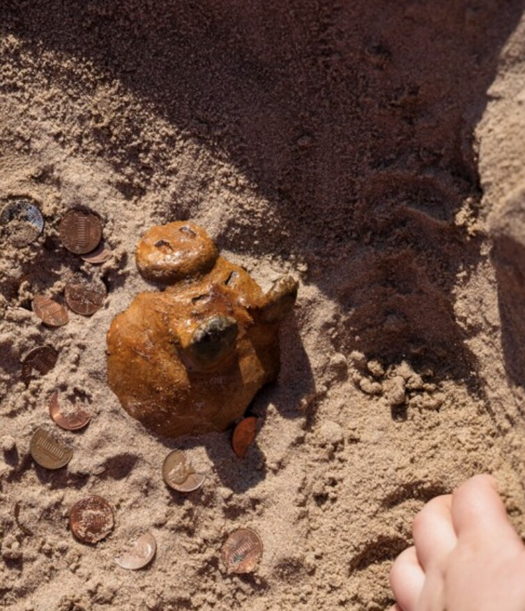

Ancient stone **structures** invite us to travel back in time and imagine how our ancestors may have lived. They also make us think about what we will leave behind for a future **generation** to find and wonder about. Do you think your home will be dug up 2000 years from now by a distant relative? Perhaps somebody in the far away future will find your favourite toy buried in the dirt and have as much fun with it as you did.

*(81 words)*
